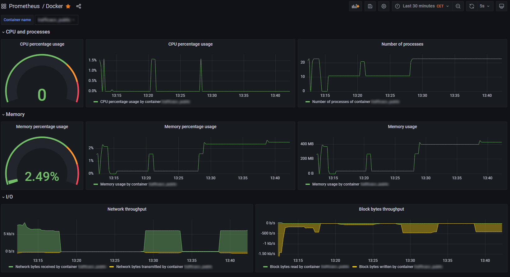

# Prometheus Docker Exporter

Prometheus Docker Exporter is a simple Python metrics exporter that collects metrics from Docker containers.
The exporter is built using FastAPI and Uvicorn, and uses the Docker API to collect metrics from running containers.
This exporter can optionally use HTTPS for secure communication.

--------------------

## Metrics

The Prometheus Docker Exporter exposes the following metrics for each Docker container:

-   `docker_container_cpu_percentage`: CPU percentage usage of container
-   `docker_container_memory_percentage`: Memory percentage usage of container
-   `docker_container_memory_usage_bytes`: Memory usage of container
-   `docker_container_memory_limit_bytes`: Memory limit of container
-   `docker_container_network_rx_bytes`: Network bytes received by container
-   `docker_container_network_tx_bytes`: Network bytes transmitted by container
-   `docker_container_block_read_bytes`: Block bytes read by container
-   `docker_container_block_write_bytes`: Block bytes written by container
-   `docker_container_pids`: Number of processes of container

Each metric is labeled with the `container_id` and `container_name`.

## Installation

To install Prometheus WireGuard Metrics Exporter you need to perform the following steps:

      `git clone https://github.com/mirekdusin/prometheus-docker-metrics-exporter.git /opt/docker-exporter`
      
### Requirements

      fastapi
      uvicorn
      prometheus-client
      docker
      pyyaml

## Configuration

The Prometheus Docker Exporter can be configured using a YAML file. The default configuration file is located at `/opt/docker-exporter/src/config.yml`.
You can customize the configuration by creating your own YAML file and passing the path to the file when you start the exporter using -c or --config argument.

The following parameters can be set in the configuration file:

-   `ip`: the IP address or hostname that the exporter should bind to (default: "localhost")
-   `port`: the port number that the exporter should listen on (default: 9375)
-   `tls_cert`: the path to the TLS/SSL certificate file for the exporter (optional)
-   `tls_key`: the path to the TLS/SSL private key file for the exporter (optional)

### Example configuration file

       ip: 0.0.0.0
       port: 9375
       tls_cert: /opt/prometheus/cert/server.crt
       tls_key: /opt/prometheus/cert/server.key

## Usage

You can run Prometheus Docker Exporter by executing the `main.py` file:

       sudo python3 main.py [-c </path/to/config.yml>]

## Running as a Systemd Service

You can run Prometheus Docker Exporter as systemd service. Example:

      [Unit]
      Description=Prometheus Docker Exporter
      After=network.target

      [Service]
      User=root
      Group=root
      Type=simple
      WorkingDirectory=/opt/docker-exporter/
      ExecStart=python3 /opt/docker-exporter/main.py
      Restart=always

      [Install]
      WantedBy=multi-user.target

For security reasons, it's a good idea to configure your firewall so that only the Prometheus server can access the exporter metrics. You can do this by adding a rule to your firewall that only allows incoming traffic on port 9375 from the IP address of your Prometheus server. This will prevent others from accessing the exporter metrics.

## License

This application is released under the MIT License.

## Contributing

If you have any suggestions, bug reports, or feature requests, please create an issue or submit a pull request.
